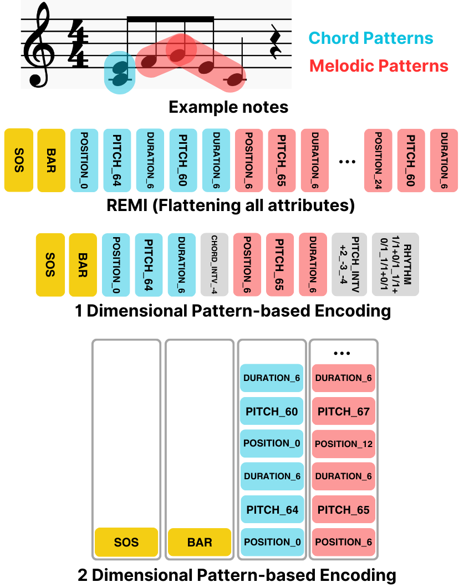
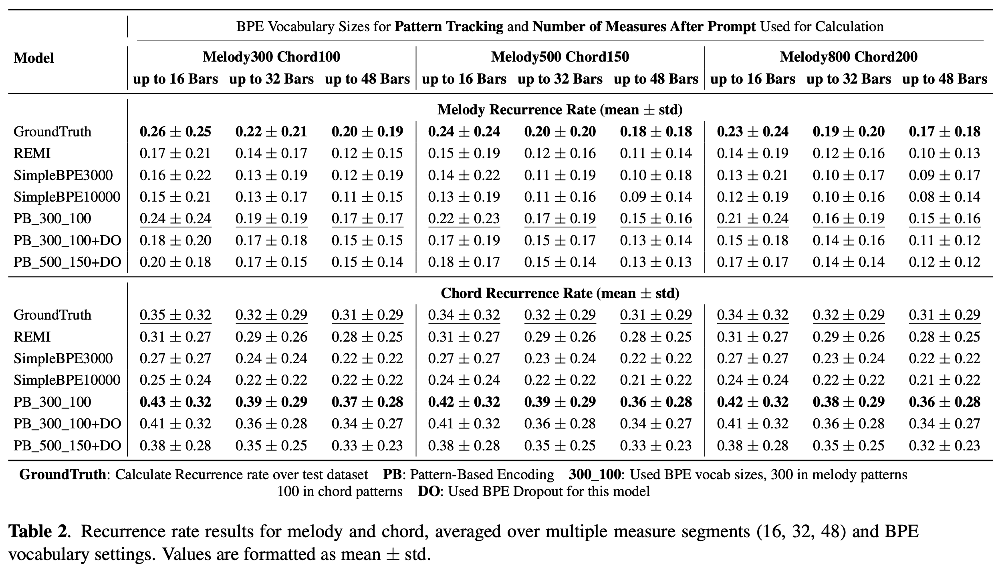
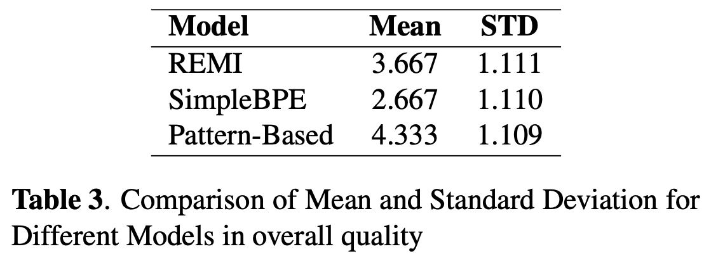

[Anonymous Authors](#) &emsp;
[Anonymous Affiliations](#) &emsp;
 
anonymous@ismir.net
{:.center}

 &emsp;
 &emsp;
 &emsp;
{:.center}

## 1. Proposed Encoding Scheme
---
> **Summary**: We propose a pattern-based encoding method for symbolic music generation. By integrating **voice separation** and **note-level Byte-Pair Encoding (BPE)**, we capture both melodic and harmonic patterns in polyphonic pieces. This approach yields more interpretable tokens and reduces sequence length compared to traditional event-based representations.

{:.center .larger}

**Key Ideas**  
- **Voice Separation**: Separates melodic vs. chord clusters before encoding, ensuring that distinct voices do not merge unnaturally in the token space.  
- **Note-Level BPE**: Applies BPE to note attributes (pitch intervals, durations, rests) for more musically meaningful “subword” patterns.  
- **Pattern-Based Tokens**: Introduces special tokens marking chordal or melodic segments, facilitating pitch augmentation and capturing longer patterns.

## 2. Experiment Results
---

### 2.1 Recurrence Rate
> We quantify how effectively the model reuses or repeats patterns in generated continuations. This “recurrence rate” is derived from analyzing how often the model revisits the same melodic or chordal patterns.

{:.center .larger}

An example table of **recurrence rate** comparisons (averaged across several test prompts) might look like this:

| Model                   | Melody Recurrence | Chord Recurrence |
|-------------------------|:-----------------:|:----------------:|
| **REMI**                | 0.129 ± 0.166     | 0.291 ± 0.259    |
| **SimpleBPE**           | 0.127 ± 0.193     | 0.251 ± 0.243    |
| **Pattern-Based (Ours)**| 0.184 ± 0.193     | 0.384 ± 0.297    |

> **Observation**: Models using Pattern-Based Encoding generally show **higher pattern recurrence**, indicating better thematic consistency in generated pieces.

 

### 2.2 Subjective Listening Test
> In addition to objective metrics, we conducted a listening test where participants rated each generation on overall musical quality and consistency.

{:.center .larger}

**Example Results**: Average preference scores (1–5 scale) from 15 participants:

| Model             | Mean Score | Std Dev  |
|-------------------|:----------:|:--------:|
| **REMI**          | 3.667      | 1.111    |
| **SimpleBPE**     | 2.667      | 1.110    |
| **Pattern-Based** | 4.333      | 1.109    |

> **Observation**: Participants showed a clear preference for **Pattern-Based Encodings**, particularly noting their structured and coherent melodic/harmonic development.

## 3. Visualizer
---
> We developed a visual interface to **display separated voices and BPE-segmented patterns**. The `.mov` file below demonstrates how **chord clusters** and **melodic clusters** are annotated in real time.

<video width="720" controls>
  <source src="video/Visualizer_Demo.mov" type="video/quicktime">
</video>

> **Note**: This demo highlights how the resulting JSON data from our pipeline is rendered as a musical score (MEI/SVG) and accompanied by synchronized audio playback.

## 4. Generated Samples
---
> Below are **three** random seed generations for **three models** (total of **nine audio clips**). Each model only receives a start-of-sequence prompt and generates up to N measures. We convert the tokens to MIDI and render the resulting audio.

|                        | **Sample #1**                                    | **Sample #2**                                    | **Sample #3**                                    |
|------------------------|:------------------------------------------------:|:------------------------------------------------:|:------------------------------------------------:|
| **REMI**               |         |         |         |
| **SimpleBPE**          |    |    |    |
| **Pattern-Based (Ours)** |  |  |  |

> **Observations**:  
> - **REMI** can sometimes generate longer sequences but may produce repetitive events.  
> - **SimpleBPE** effectively shortens sequences but may suffer from unintuitive token merges.  
> - **Pattern-Based** tends to preserve meaningful chord/melody interplay, yielding more varied and coherent passages.

