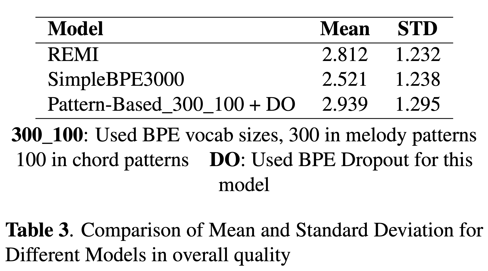

[Anonymous Authors](#) &emsp;
[Anonymous Affiliations](#) &emsp;
 
anonymous@ismir.net
{:.center}

 &emsp;
 &emsp;
 &emsp;
{:.center}



## Content
---
- [Proposed Encoding Scheme](#encoding-scheme)
- [Experiment Results](#experiment)
  - [Recurrence Rate](#recurrence-rate)
  - [Subjective Listening Test](#listening-test)
- [Visualizer](#visualizer)
- [Generated Samples](#generated-samples)

## Proposed Encoding Scheme {#encoding-scheme}
---

Comparison of encoding methods.
{:.center .larger}
> __Key Ideas__:  **Voice Separation** - Separates melodic vs. chord clusters before encoding, ensuring that distinct voices do not merge unnaturally in the token space.
 
**Note-Level BPE** - Applies BPE to note attributes (pitch intervals, durations, rests) for more musically meaningful “subword” patterns.  
 
**Pattern-Based Tokens** - Introduces special tokens marking chordal or melodic segments, facilitating pitch augmentation and capturing longer patterns.
 

## Experiment Results {#experiment}
---
### Recurrence Rate {#recurrence-rate}

A table of **recurrence rate** comparisons.
{:.center .larger}

> __Note__: We quantify how effectively the model reuses or repeats patterns in generated continuations. This “recurrence rate” is derived from analyzing how often the model revisits the same melodic or chordal patterns.
 

---

### Subjective Listening Test {#listening-test}

A table of **Mean and Standard Deviation** comparisons.
{:.center .larger}

> __Note__: Below are **three** random seed generations for **three models** (total of **nine audio clips**). Each model only receives a start-of-sequence prompt and generates up to N measures. We convert the tokens to MIDI and render the resulting audio.
 

## Visualizer {#visualizer}



## Generated Samples {#samples}

> __Note__: Below are **three** random seed generations for **three models** (total of **nine audio clips**). Each model only receives a start-of-sequence prompt and generates up to N measures. We convert the tokens to MIDI and render the resulting audio.

|  | __Sample#1__{:.center} | __Sample#2__{:.center} | __Sample#3__{:.center} |
| __REMI__ |  |  |  |
| __SimpleBPE*__ |  |  |  |
| __Pattern-Based (Ours)__ |  |  |  |

